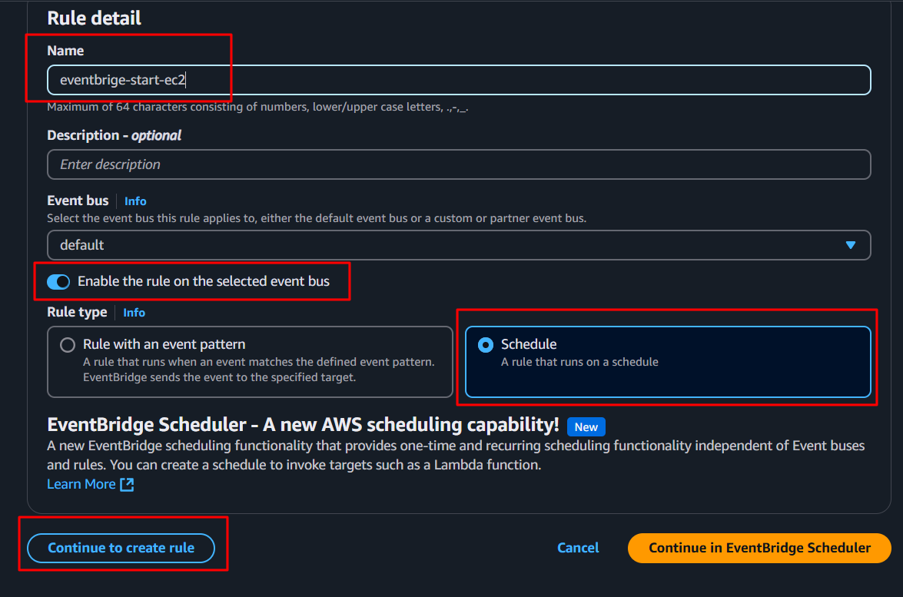
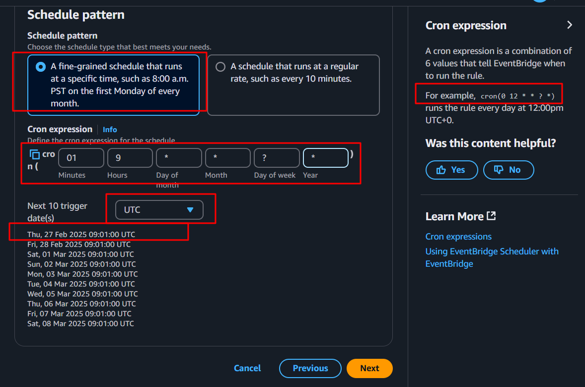
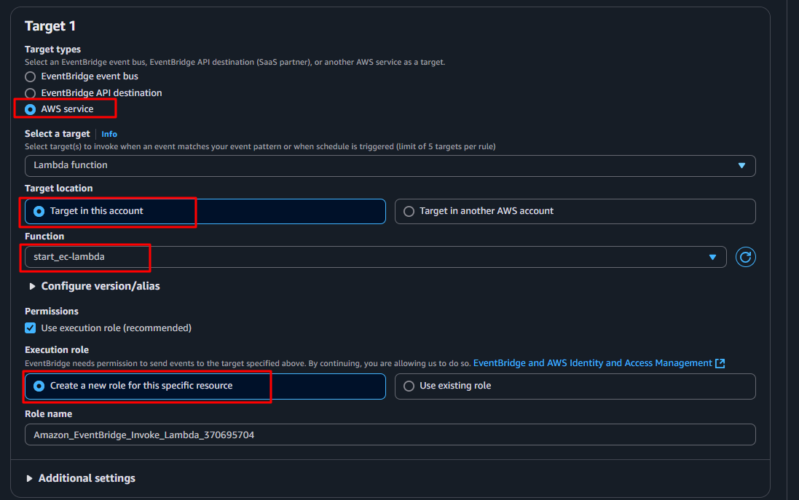

# step to create lambda function  (stop and start ec2 instance spec time)

1 . create in-line policy  { give permission  stop and start ec2 only, use this  in-linepolicy.json  }

2 .  create Role and attache this policy.

3 .  create Lamdba Function [past this python code ]

```
        import boto3  
        region = 'us-east-1'
        instances = ['i-0648877a98fb941e9', 'i-0f6be46fbe136f281']
        ec2 = boto3.client('ec2', region_name=region)
       
        def lambda_handler(event, context):
            ec2.stop_instances(InstanceIds=instances)
            print('stopped your instances: ' + str(instances))
```

4 . create event Bridge for trigger the lambda function
  step 1 
     

   step 2 
     
   
   step 3 
     


# Start the stoped EC2 Instance using lambda Function (use this code)
```
import boto3  
region = 'us-east-1'
instances = ['i-0f6be46fbe136f281', 'i-0648877a98fb941e9']
ec2 = boto3.client('ec2', region_name=region)

def lambda_handler(event, context):
    ec2.start_instances(InstanceIds=instances)
    print('started your instances: ' + str(instances))
```
